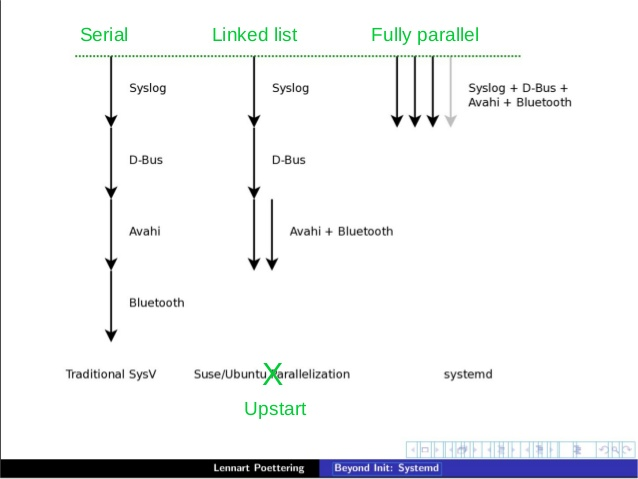

=======================
Lets Talk about systemd
=======================

:Name: Praveen Kumar
:Contact: kumarpraveen [AT] fedoraproject DOT org
:Date: 2015-07-11

Agenda
======

- What is systemd
- What capabilities it provides
- How to use systemd
- How a service file looks like
- Intro about systemd-nspawn
- Resources

What is systemd
===============

- Modular
- Asynchronous and concurrent
- Create snapshot
- features a fully language-agnostic API

... Much more

systemd Cont...
===============

How to use systemd
==================

- Default init system for CentOS
- List out units

  + systemctl list-units

- List out services

  + systemctl list-units --type service
  + systemctl list-units --type service --all
  + systemctl list-unit-files --type=service
  + ls /usr/lib/systemd/system/\*.wants

How to use systemd cont...
==========================

- List out targets

  + systemctl list-units --type targets

- Check CGroup tree

  + systemd-cgls

Service file Template
=====================

::

    [Unit]
    Description=The Apache HTTP Server
    After=network.target remote-fs.target nss-lookup.target

    [Service]
    Type=notify
    Environment=LANG=C
    ExecStart=/usr/sbin/httpd $OPTIONS -DFOREGROUND
    ExecReload=/usr/sbin/httpd $OPTIONS -k graceful
    # Send SIGWINCH for graceful stop
    KillSignal=SIGWINCH
    KillMode=mixed
    PrivateTmp=true

    [Install]
    WantedBy=multi-user.target

systemd snapshot
================

- Crate a snapshot of existing unit config

::

    $ sudo systemctl snapshot test
    $ sudo systemctl -all list-units | grep test
    $ sudo systemctl show test
    $ sudo systemctl isolate test.snapshot
    $ sudo systemctl delete test

sysemd-nspawn
=============

- systemd-nspawn is a small utility which is use to create light weight containers
- Setup a container

::

    $ sudo yum -y --nogpg --releasever=7 --installroot=/srv/mycontainer \
    install systemd passwd yum vim-minimal

sysemd-nspawn cont...
=====================

- Setup container password

::

    $ sudo systemd-nspawn -D /srv/mycontainer

- Start a container

::

    $ sudo systemd-nspawn -jbD /srv/mycontainer

Resources
=========
- http://www.freedesktop.org/wiki/Software/systemd
- http://linux.xvx.cz/2014/06/systemd-cheatsheet.html

Thank You
=========
