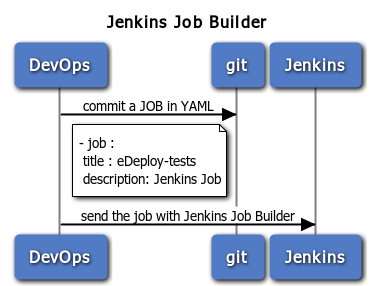

===================
Jenkins Job Builder
===================

Job creation and management should be easy.

:name: Praveen Kumar
:contact: kumarpraveen [AT] fedoraproject DOT org
:date: 2015-05-16

Agenda
======

- What is Jenkins Job Builder (JJB)
- Why JJB
- Installation and Configuration
- Write JJB Template
- Test JJB Template
- Deploy JJB Template

What is Jenkins Job Builder
===========================

- A system for configuring Jenkins jobs using simple YAML files stored in Git.

WHY JJB
=======

- Jenkins jobs are stored in XML format on the server which is not the best
  readable format to write a job manually. That’s why it’s highly preferable
  to manage jobs via graphic interface.
- Enables you to manage jobs in human readable text format.
- Enables you to store jobs in a version control system.
- Enable to configure remotly Jenkins with new jobss

Installation and Configuration
==============================

- $ pip install jenkins-job-builder

Writing JJB Template
====================

- Jenkins Jobs Defaults in defaults.yaml.
- Jenkins Jobs Macros to give larger config sections meaningful names in macros.yaml.
- Project specific configurations in project_name.yaml.
- Job template configurations. Need a projects.yaml file to specify
  how the templates should be filled out and templates go in template_name.yaml.

Test JJB Template
=================

- $ jenkins-jobs test .

Demo Time
=========

- Source: https://github.com/praveenkumar/jjb-sample

Questions
=========
**?**

Thank You
=========
